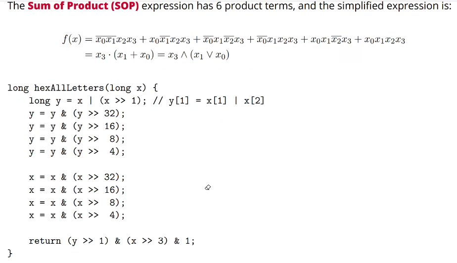

# 一、无符号整数、二进制补码

  第一层抽象  电平->数字

  ## *整数表示  事实上是一种符号序列的映射
  假设$a$是在内存上32bits的序列，那么无符号编码：<br>
  $$Value=\sum_{i=0}^{31}a_{i}\times2^i,a_i\in  \{0,1\} $$
  补码：
  $$Value=(-1)\times a_{31}\times 2^i+\sum_{i=0}^{30}a_i\times2^i,a_{i}\in \{0,1\}$$

  这种表示可以看成数学抽象，一种符号序列的映射，会存在overflow的问题

  # 二、C语言、位操作、树状数组

  ## lowerbit
  ```
  1000100取出最后的一个1->100
  lowbit(x){
      return x & (~x+1);
  }
  ```
  ## 树状数组
   https://www.bilibili.com/video/BV1ce411u7qP/?spm_id_from=333.337.search-card.all.click&vd_source=c3bd6ec25bfab695e9a03dcab5127159
  
  leetcode307

  ## 判断一个十六制数中是否全为字母
  
  ```
  0xabcdef   true<br>
  0xabc123   false
  想法就是获得一个逻辑式后，用与运算取出每个十六进制的x3x2x1，然后进行操作  
```
 $x_3x_2x_1x_0$可以用卡诺图分析



# 三、浮点数、类型转换


